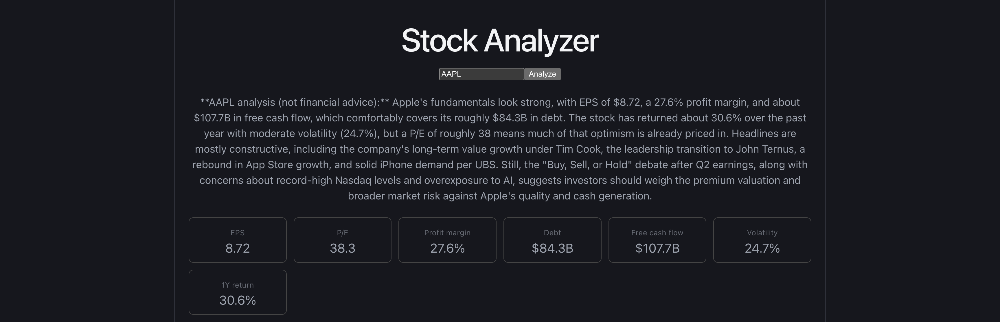
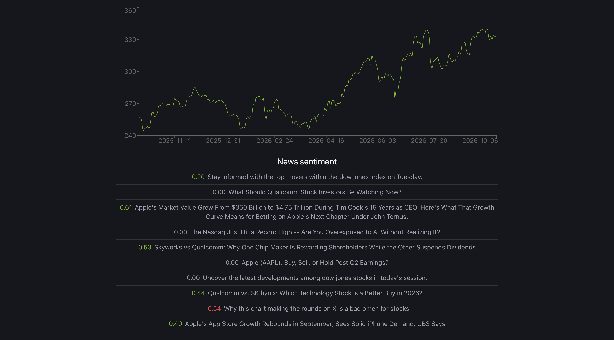

# Stock Analyzer

A full-stack financial research platform: enter a ticker and get price charts, key fundamentals, news sentiment, and an AI-written summary.

## Features
- 1-year price chart
- EPS, P/E, profit margin, debt, free cash flow, volatility, 1-year return
- News headlines scored with VADER sentiment
- AI summary generated with the Claude API
- PostgreSQL caching to avoid repeat API calls

## Tech stack
React, TypeScript, FastAPI, PostgreSQL, Docker, AWS EC2, Claude API, yfinance, Finnhub

## Screenshots

## Run locally
1. Create `backend/.env` with `FINNHUB_KEY=...` and `ANTHROPIC_API_KEY=...`
2. Run `docker compose up --build`
3. Open http://localhost:5173
